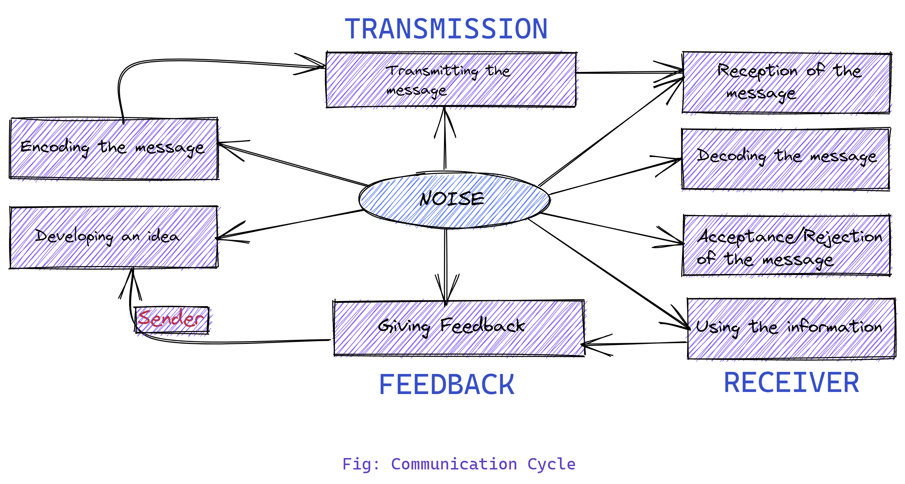
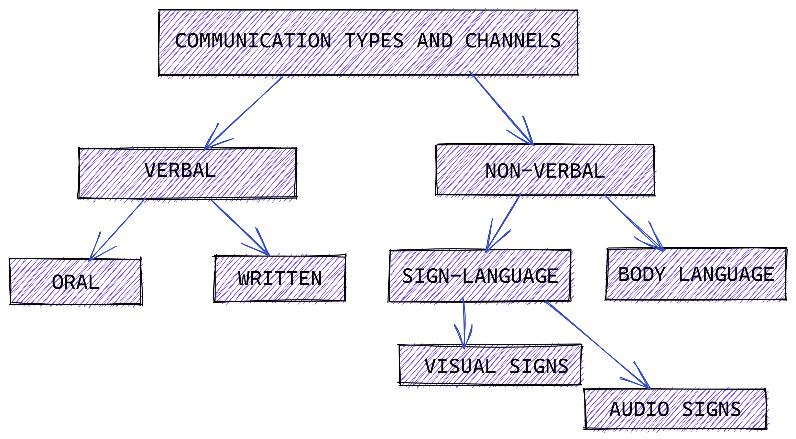

# COMMUNICATION IN SOCIETY AND WORKPLACE
## What is communication? 
- Communication is **the act of giving, receiving, and sharing information** -- in other words, talking or writing, and listening or reading. Good communicators listen carefully, speak or write clearly, and respect different opinions.
---
## Communication cycle.

---
## What are the types of communication? 

The different types of communication are:
 * Verbal communication (includes face-to-face, telephone, radio or television and other media.
* Non verbal communication (covering body language, gestures, how we dress or act, where we stand)

* Written communication (which includes letters, e-mails, social media, books, magazines, the Internet and other media)
* Visual communication (maps, logos and other visualizations can all communicate messages.)
---
## Communication types and channels

---
## Difference between social and workplace communication

- One of the first differences in business communication is that it is much more formal than social communication.
- Business communications often need to happen much faster than social ones.
- Hierarchy is important in business communications, whereas it may have less significance socially. 
- Mistakes in spelling, grammar, and punctuation are acceptable in social communication. This is not the case in business settings. Failure to pay attention to these details may be viewed as sloppy and can cause a bad impression.
---
## What is social communication?
Social communication refers to the emergence of verbal and nonverbal skills, social interaction, and social cognition. It is often viewed as a form of communication that is ‘unwritten’ and that people seem to ‘just know.’ Communication in this area includes interaction with peers, family members, providers, and educators. Social communication behaviors include understanding and using appropriate facial expressions, eye contact, and body language.

---
## Social communication abilities:
* Initiation of communication and turn-taking
* Eye contact
* Willingness to maintain conversation
* Ability to manipulate conversational topics
* Comprehension of nonverbal and verbal cues in various situations
* Ability to verbally and nonverbally communicate including speech, signs, gestures, pictures, written words
---
## Why is social communication important?
Social communication (pragmatics) is important in order to be able to build social relationships with other people. It is also important academically, as many curriculum based activities rely on working in groups and communication between peers.

---

## What is workplace communication?

Workplace communication is the process of exchanging information and ideas, both verbally and non-verbally between one person or group and another person or group within an organization. It includes e-mails, videoconferencing, text messages, notes, calls, etc.

---
## Skills for effective workplace communication.
* Getting the message across efficiently depends on the skills of the communicator such as presentation skills, group facilitation skills, negotiation and written communication skills. Successful communication also depends upon the capacity of the employees to understand the information. This may require providing employees with basic financial literacy such as financial statements, sales, profitability, etc.

* When selecting a candidate, most employers seek those with strong speaking and writing skills. Problem solving and self-motivation are also important skills in the workplace. These allow rapidly-changing environments to become less of a challenge.

---
## Barriers to workplace communication.
* Physical barriers
* Language barriers
* Emotional barriers
* Cultural barriers
* Perception barriers
---
## Physical barriers.
The physical structure, location and construction of the workplace can act as a barrier to effective communication. Employees seated remotely from each other hinders effective interaction.

---
## Language barriers.
Employees with different native languages may work in an organization. Everyone may not be comfortable or familiar with other languages, which creates a barrier to effective workplace communication. Differences in slang or register can create issues impeding proper work task completion.

---
## Emotional barriers.
Emotional barriers like fear, inferiority, shyness, lack of self confidence and skills may stop an employee in communicating effectively with his or her colleagues.

---
## Cultural barriers.
Employees from different cultures with different practices may work in an organization. Cultural diversity without understanding can act as a barrier to effective communication.

---
## Perception barriers.
Employees will have different experiences, values, preferences and attitudes. These may lead to a variety of assumptions and can act as a communication barrier.

---
## Other barriers to communication

---