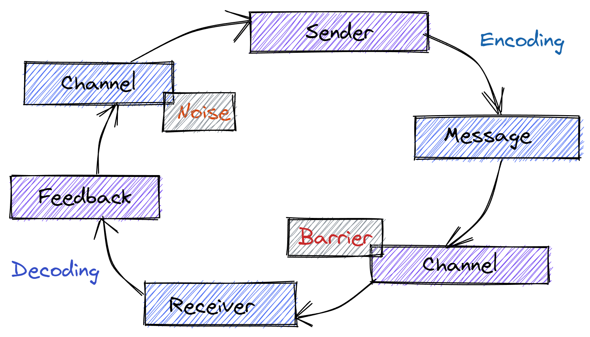
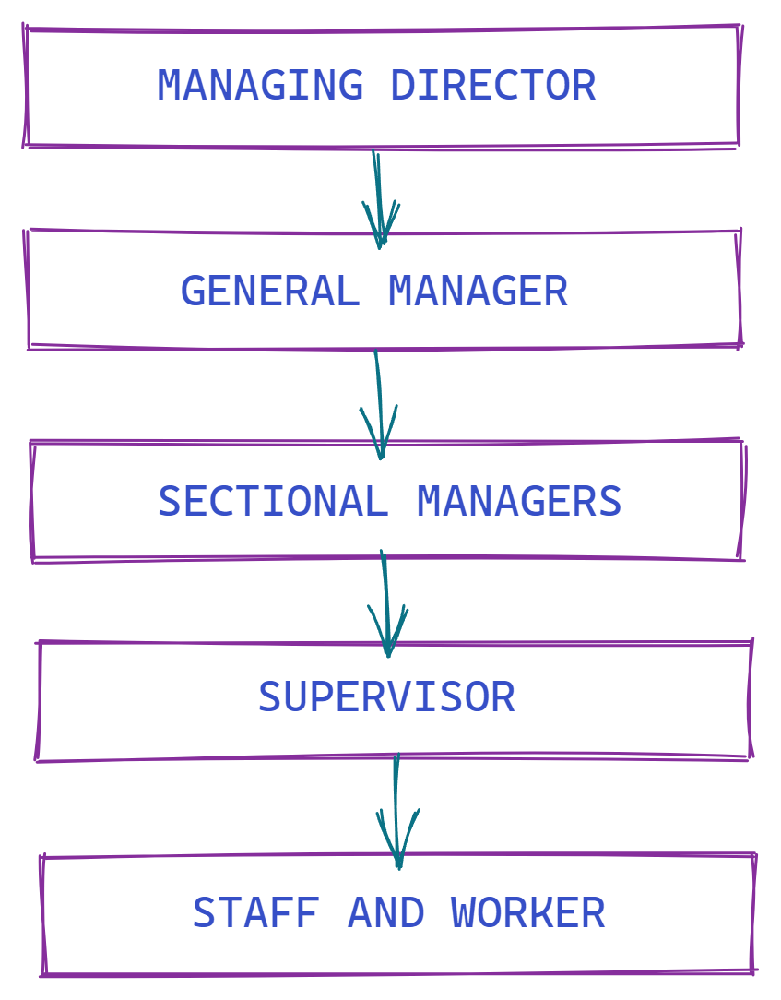
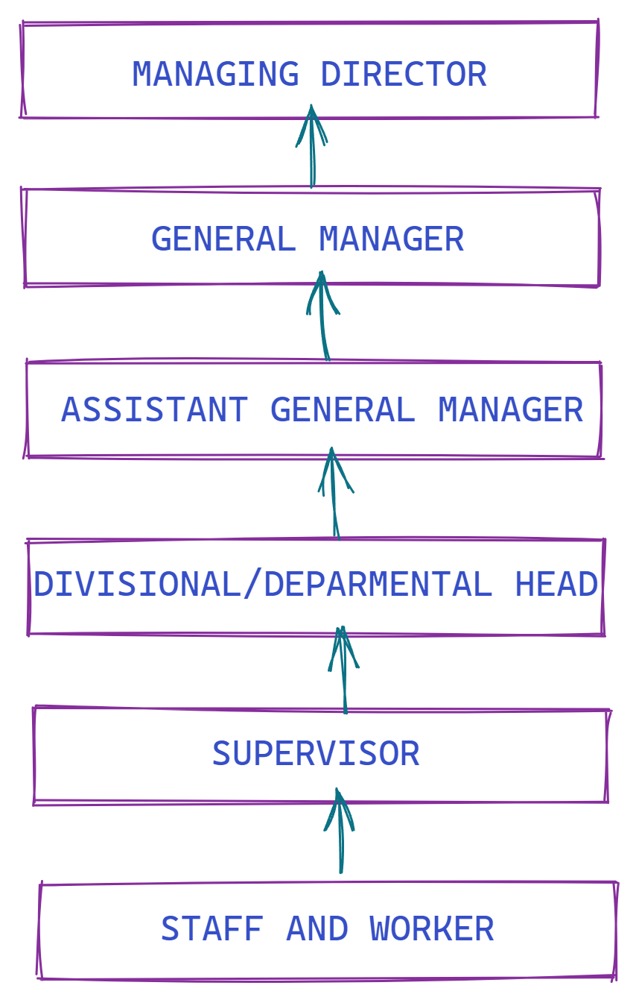
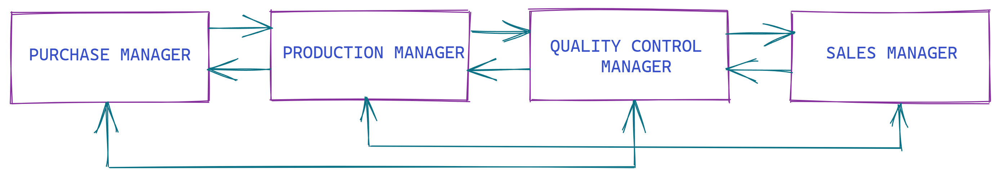

# Communcation is what??

It is a process of exchanging-

1. Information 
2. Ideas

3. Thoughts 
4. Feelings

5. Emotions

Through-

6. Speech Signals

7. Writing

8. Behavior
---
# Process of Communication

---
# Types of Communication

People communicate with each other in a number of ways that depend upon the message and its context in which it is being sent.

Types of communication based on the communication channels used are

- Verbal Communication

- Nonverbal Communication
---
# Oral Communication

- In oral communication, Spoken words are used. 

- It includes face-to-face conversations, speech, telephonic conversation, video, radio, television, voice over internet.

- Communication is influence by pitch, volume, speed and clarity of speaking.

### Advantages-

- It brings quick feedback. 

- In a face-to-face conversation, by reading facial expression and body language one can guess whether he/she should trust what's being said or not.

### Disadvantages 
- In face-to-face discussion, user is unable to deeply think about what he is delivering, so this can be counted as a fault.
---
# Nonverbal Communication

- Nonverbal communication is the sending or receiving of wordless messages. Such **as gesture, body language, posture, tone of voice** or **facial expressions**, is called nonverbal communication.

- **Nonverbal communication is all about the body language of speaker.**

*Nonverbal communication have the following three elements-*

- **Appearance Speaker-**

    clothing, hairstyle, neatness, use of cosmetics

- **Surrounding-**  room size, lighting, decorations, furnishings

- **Body Language-**

    facial expressions, gestures, postures

- **Sounds-**

    Voice Tone, Volume, Speech rate
    Written
    
---

# Written communication

- In written communication, written signs or symbols are used to communicate.

- In written communication message can be transmitted via email, letter, report, memo etc.

- Written Communication is most common form of communication being used in business.

### Advantages-

  Messages can be edited and revised
   Written communication provide record and backup. A written message enables receiver to fully understand it and send appropriate feedback. 

### Disadvantages

Written communication doesn't bring instant feedback. It take more time in composing a written message as compared to word-of-mouth and number of people struggles for writing ability

---
# Levels of Communication

- **Intrapersonal Communication** is communication that occurs in your own mind. It is the basis of your feelings, biases, prejudices, and beliefs.

     ##### -Examples are when you make any kind of decision-what to eat or wear. When you think about something - what you want to do on the weekend or when you think about another person.

- **Interpersonal communication** is the communication between two people but can involve more in informal conversations. 

    ##### -Examples are when you are talking to your friends. A teacher and student discussing an assignment. A patient and a doctor discussing a treatment. A manager and a potential employee during an interview.
- **Small Group communication** is communication within formal or informal groups or teams. It is group interaction that results in decision making, problem solving and discussion within an organization.

    ##### -Examples would be a group planning a surprise birthday party for someone. A team working together on a project.
- **One-to-group communication** involves a speaker who seeks to
inform, persuade or motivate an audience. 

    ##### -Examples are a teacher and a class of students. A preacher and a congregation. A speaker and an assembly of people in the auditorium.
- **Mass communication** is the electronic or print transmission of messages to the general public. Outlets called mass media include things like radio, television, film, and printed materials designed to reach large audiences.

    ##### -A television commercial. A magazine article. Hearing a song on the radio. Books, Newspapers, Billboards. The key is that you are reaching a large amount of people without it being face to face. Feedback is generally delayed with mass communication.
---

## FLOW OF COMMUNICATION IN FORMAL ORGANIZATION:

- Flow of communication in an organization is classified into four types.

    1. Downward communication

    2. Upward communication

    3. Lateral communication

    4. Diagonal communication
---
## FLOW OF COMMUNICATION IN FORMAL ORGANIZATION: 
### 1. Downward communication

Communications that **flow from managers to employees** to inform, direct, coordinate, and evaluate employees.

---

## FLOW OF COMMUNICATION IN FORMAL ORGANIZATION:
### 2. Upward communication

Communications that **flow from employees up to managers** to keep them aware of employee needs and how things can be

improved to create a climate of trust and respect.

---

## FLOW OF COMMUNICATION IN FORMAL ORGANIZATION:

### 3. Lateral (Horizontal) Communication

 Communication that **takes place among employees on the same level** in the organization to save time and facilitate coordination.

 

---
## FLOW OF COMMUNICATION IN FORMAL ORGANIZATION: 
### 4. Diagonal Communication

Communication that **cuts across both work areas and organizational levels** in the interest of efficiency and speed.

---
## Organizational Communication.

- All the patterns, network, and systems of communications within
an organization.

- Organizational communication is classified into,

    2a) **Formal communication**

    2b) **Informal communication**
---
## TYPES OF COMMUNICATION:

### Organizational Communication
a) **Formal communication** - Communication that **follows the official chain of command** or is part of the communication required to do one's job.

b) **Informal commmunication**- Communication that is not defined by the organization's hierachy.

---
## TYPES OF COMMUNICATION NETWORK:

- Communication network is defined as the **channels that are used to pass information** serially from one person to another.

    The communicating networks are as follows:

    1. Simple chain

    2. Wheel chain

    3. Circular chain

    4. Free flow chain

    5. Inverted V chain

### 1. Simple chain:

- Simple chain network exists between **a superior an his subordinate.**

- Communication flows either upward or downward.
- **Control will be easier** but this network **consumes time.**
### 2. Wheel chain:

- In this network subordinates can communicate **with their common superior.**

- Subordinates are **not allowed to communicate among themselves.**

- **Coordination** among subordinates **is difficult.**
### 3. Circular chain:

- Communication moves in a **circular shape.**

- Here a subordinate can **communicate with his or her neighboring coworker.**

- Flow takes more time.
### 4. Free flow chain:

- A subordinate can **communicate with anyone** in the organization.

- Flow of communication is fast but **coordination problem exists.**
### 5. Inverted V chain:

- In this network chain, a subordinate is allowed to communicate with **two level of hierarchy.**
---
## What's Grapevine ??

- To hear something through the grapevine is to learn of something informally and unofficially by mean of **gossip** and **rumor.**

- Informal vehicle through which message flow throughout the organization.
---
## Grapevine Characteristics :-

- oral mostly undocumented

- fast (hours instead of days)

- crossing organizational boundaries

- inaccuracy: deletion of crucial details

-  Not controlled by management.
---
## Benefits and Disadvantages :-

- Spreads Rapidly.

- Feedback is Quick.

- Problems/Good news exist. 

- Substitute for formal channel of communication

- Group Cohesiveness. 
- Signals that.

- The grapevine is not trust worthy always as it doesn't follow official path of communication & is spread more by gossips and unconfirmed report. 
- Untruth information must of the time 
- Partial information only spreads (rumors)

- Hampers the goodwill of the organization or the people
---
## Four Types of Grapevine Chains

- Single Strand Chain

- Gossip Chain

- Probability Chain

- Cluster Chain
---
## Preventing Rumors :

- provide information through the formal system of communication on the issues important to the employees 

- supply employees with a steady flow of clear, accurate and timely information

- present full facts

- keep formal communication lines open and the process as short as possible.
---