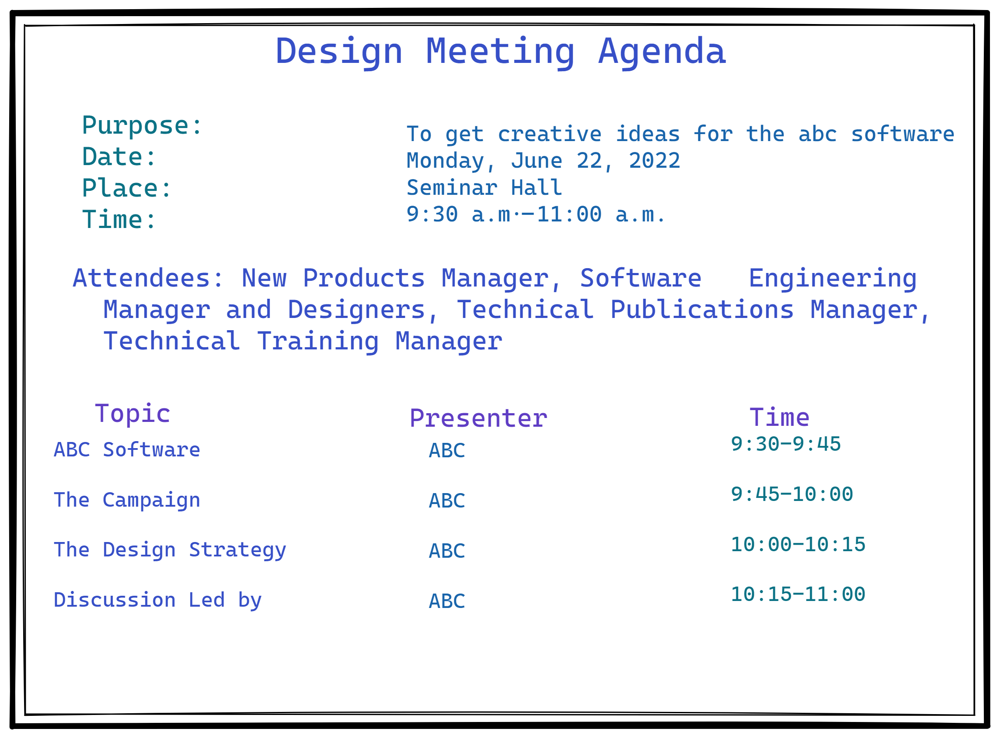

#  MEETING, NOTICE, AGENDA AND MOM

## MEETINGS
* A meeting is the coming together of three or more people to exchange information in a planned manner.
* The objective of a meeting is to brainstorm agendas and arrive at a decision/conclusion.
* It requires a NOTICE which is a call or invitation to attend it.
* It has a list of things/ AGENDA to deal with.
* The outcome of a meeting is systematically written in the form of a Minutes of a Meeting (MOM)
---
## ABOUT MEETINGS
A meeting has a convenor who calls it and a chairperson who directs it.

Types of meeting: 
1. Informative : where the purpose is to give information to the participants.
2. Consultative : in which the members are consulted to solve a problem
3. Executive: in which decisions are taken by those empowered to do so.
---
## NOTICE
- Notice is a formal means of communication, written or printed.
* It is used for organizational communication.
* The purpose of a notice is to announce or display information to a specific group of people.
* Notices are pinned up in display boards in public spaces visible to all.
* Notices issued by governments appear in newspapers.
---
## HOW TO WRITE A NOTICE.
* Notice should give complete information.
* Notices are factual and to the point.
* Must be written in clear and lucid style.
* Must have easily understandable language.
* Must have some attractive attributes like catchy title…
---
## CONTENTS OF A NOTICE 
- Always write notice in a box.
- It should contain necessary details like:

    1. Name of the organization
    2. Date of issue of the notice.
    3. Title / Subject of the notice.
    4. Date, time, venue.
    5. Name, signature and contact details.
---
## Format in a glance 

---
## SAMPLE NOTICE

             
---
## Notice writing Tips

* Do not cross the word limit to avoid penalty of marks. The prescribed word limit is 50 words.

* Repetition of any information should be avoided. 
* Always enclose the notice in a box. Make sure you draw the box with a pencil.

* Keep your notice short, crisp and to-the-point. 
* Highlight the word "NOTICE and "TITLE". It can be either bold or underlined.

* The title should be captivating and eye-catching.
*  Don't make hypothetical information and facts. 
* Make use of what's given in the question.

* Make sure you do not mention your personal information.

* Make use of all the available information in the question.

* Your answer shall include answers to all the 5 W's-What, Why, When, Where and Who.

* The purpose for which it is being written should be stated clearly. 
* Focus on presentation and darity.

---
## POINTS TO REMEMBER.
* Notice can use capital letters for details such as names of organizations, captions, an important detail within the massage itself. 
* The date of the notice can be placed at the top right or left, or bottom right or left hand corner.

* The entire content of the notice is centred within a box.
* The individual responsible for issuing the notice indicates the name below.
---
## AGENDA
* Agenda is the list of topics or issues to be discussed in a meeting.
* Agenda is also known as the order of business.
* Agenda comes from the Latin word agendum meaning, a thing to be done.
* The agenda may be a part of the notice or attached as an annexure.
* The convenor/ secretary prepares it in consultation with the chairperson.

---
## FORMAT OF AGENDA

---

## POINTS TO REMEMBER
* The agenda should be distributed to attendees a day or two before the meeting.
* For a meeting in which participants are required to make a presentation, try to distribute the agenda a week or more in advance.
* If the meeting includes presentations, list the time allotted for each speaker. (Refer to the next slide)
* Finally, indicate an approximate length for the meeting so that participants can plan the rest of their day.
---
## DESIGN MEETING AGENDA

---
## MINUTES TO A MEETING (MOM)
* The MOM is the detailed record of the discussions or decisions of a meeting.

* MOM is an official, accurate documentation of the proceedings.

* MOM is written in the past tense using third person reported speech.
---
## TYPES OF MOM
There are basically three types of MOM
* Verbatim: This is where everything is recorded word to word and is used documentation and reporting.
* Minutes of resolution: This records the main resolutions reached. 
* Minutes of narration: This is the concise summary of all the discussion that took place, reports receives, resolutions made and actions to be taken.
---
## CONTENT OF THE MOM
The MOM keeps a record of :
* Motions and amendments of a meeting.
* The proposer and the seconder of the motion.
* The details of the voting, if any.
* Recommendations.
* Decisions and resolutions.
* Tasks assigned to individuals or subcommittee. 
---
## THE ORDER FOR TYPING MOM
* Heading - name of group, date, time and place 
* Meeting purpose Statement

* Those who were present in alphabetical order (preferably)

* People who were invited

* Apologies from members who were unable to attend the meeting

* Observers

* Reading of the last minutes 
* Matters arising from the minutes

* Reports and general matters 
* Any other business

* Date of next meeting 
* Chairman's signature
---
## STYLE OF WRITING MINUTES OF MEETING
image

---
# SAMPLE MOM

---
## SOME IMPORTANT POINTS
* The members of the meeting hierarchically is as follows:
1. Chairman/President
2. Secretary
3. Convenor (one who calls the meeting)
4. Treasurer
5. List of attendees (committee /sub-committee members)
6. Invited Guests/external experts (if any)
7. Members absent
8. MOM is generally written by the Secretary from the notes taken down from the meeting.
9. The ending of a MOM states ; The meeting ended with a vote of thanks to the chair.
10. It is crucial that the MOM is accurate because they can act as the legal record of the proceedings of the meeting.
---
