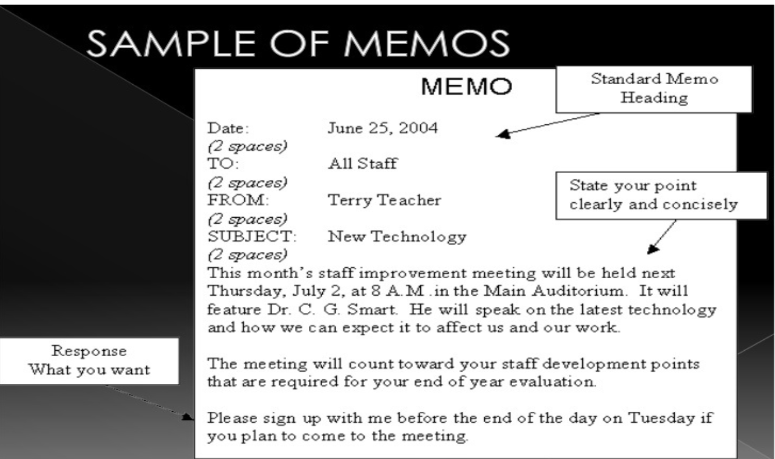
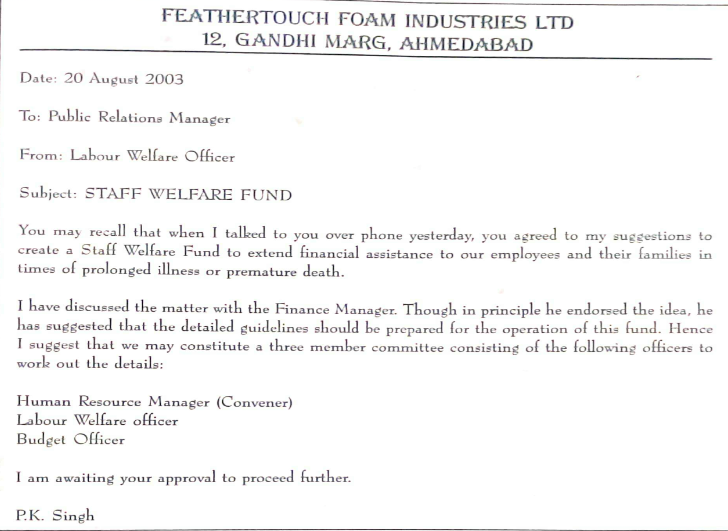

# Key to Writing Successful Memorandum

## What is a Memorandum?

- A memorandum is considered "inside" correspondence.

- It is written to someone in your company
- A memo is less formal than a letter.

- It usually conveys one idea and is likely to be short.

- Effective memos are clearly written with the objective stated in the first sentence.
---
## Advantages of a Memorandum
### **Memos are:**

- Quick

- Inexpensive

- Convenient

- A Written Record
---
## Purpose of Writing a Memorandum
- To Inquire

- To Inform

- To Report

- To Remind

- To Transmit

 - To Promote Goodwill
 ---
 ## Kinds of Memorandum
Depending on their purpose, memos can be classified
into **three major categories**:

- Documentary Memorandum
- Congratulatory Memorandum
- Disciplinary memorandum
---
## Structure and Layout
Standard Memorandums are divided into five main sections and two optional sections to organize   information. They are:
- Heading Segment
- Opening Segment
- Discussion Segment
- Closing Segment
- Signature Segment
- Necessary Attachment (optional)
- Discussion Segment (optional)
---
## Structure and Layout

---
## Sample Memorandum Template

---

---
## Tips to Prepare a Memorandum
- Use the standard format.
- Include all necessary segments.
- State clearly the context and purpose in the opening segment.
- Maintain a positive tone.
- State in the closing segment what action you expect from the recipient.
- Keep your memo short.
- Maintain an impersonal tone.
- Maintain the Left-Align format. 
