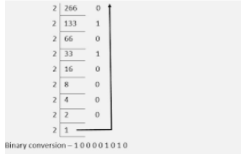
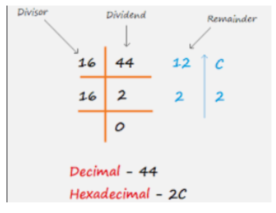
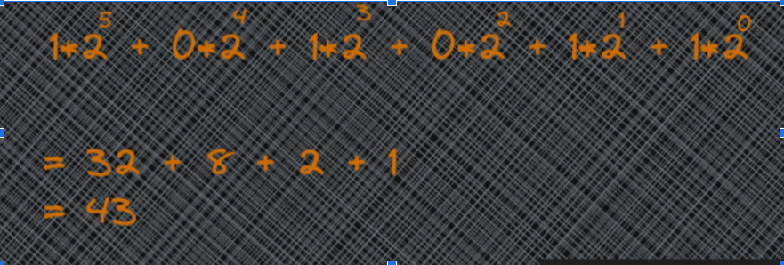
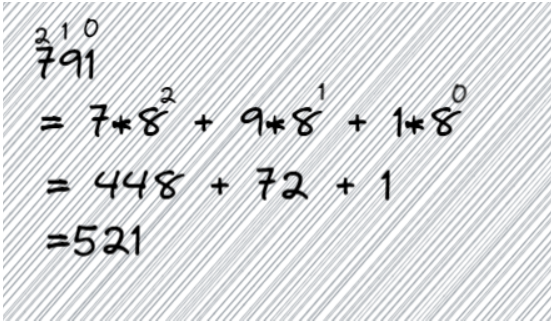
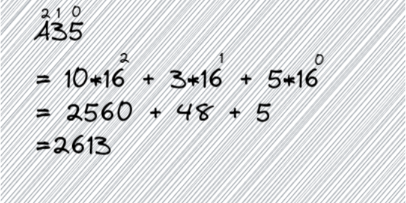
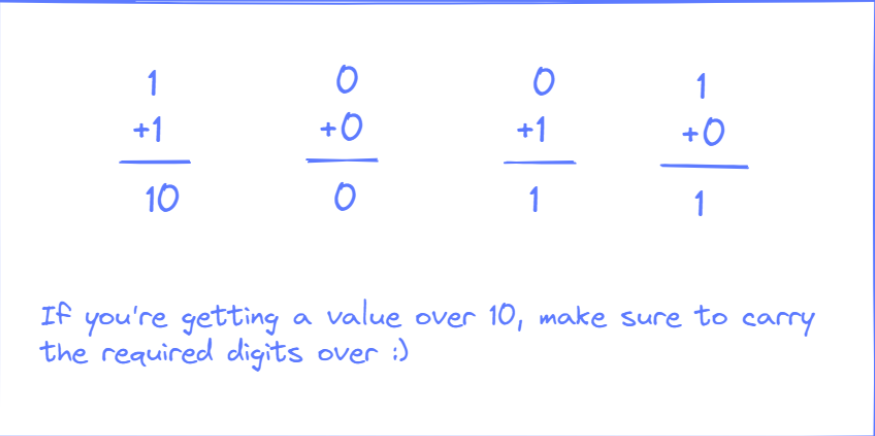
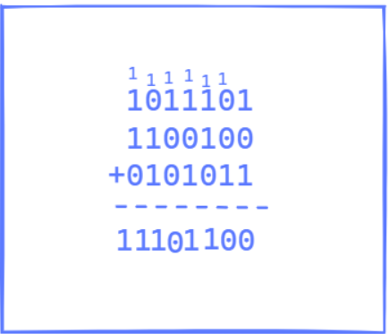
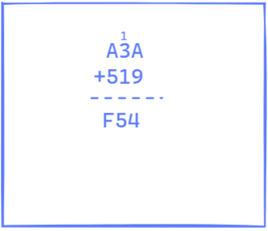

# Module 1- Number System

Computers only understand the language of 0's and 1's, not the language of humans. Hence, every data input is converted into digital signals represented through strings of number. Even all the letters we type into our computer have a numeric value representation that is understood by our computers. This is known as ASCII.
Therefore, in order to effectively communicate with the computer, it is essential to understand how the number system works in the computer.

## Binary Number System

A binary number is a number expressed in the base-2 numeral system or binary numeral system, a method of mathematical expression which uses only two symbols: typically "0" and "1".

Now, you might ask, what is the Binary number system?

Well it is a system of representing decimal Numbers as binary numbers, using only 0 and 1.
Since it has only 2 digits, we can say that the binary number system has the base 2.

## Octal Number System

An octal number is a number expressed in the base-8 numeral system or octal numeral system, a method of mathematical expression which uses eight symbols: the numbers 0-7.

It is a system of representing decimal Numbers as octal numbers, using only the numbers 0-7.
Since it has only 8 digits, we can say that the binary number system has the base 8.

## Decimal Number System

A decimal number is a number expressed in the base-10 numeral system or decimal numeral system, a method of mathematical expression which uses ten symbols: numbers 0-9
Now, you might ask, what is the Binary number system?

Simply speaking, the number system we use in our daily lives. It has 10 digits and hence a base of 10.

## Hexadecimal Number System

A hexadecimal number is a number expressed in the base-16 numeral system or hexadecimal numeral system, a method of mathematical expression which uses sixteen symbols: the numbers 0-9 and letters A-F.

It is a system of representing decimal Numbers as hexadecimal numbers, using only the numbers 0-7.
Since it has 16 digits, we can say that the hexadecimal number system has the base 16 .

# Base Conversion

## Decimal to any other base

### Decimal to Binary

Perform the Following Steps:

    Step 1: Divide the given decimal number by “2” where it gives the result along with the remainder.
     Step 2: If the given decimal number is even, then the result will be whole and it gives the remainder “0”
     Step 3: If the given decimal number is odd, then the result is not divided properly and it gives the remainder   “1”.
     Step 4: By placing all the remainders in order in such a way, the Least Significant Bit (LSB) at the top and Most Significant Bit (MSB) at the bottom, the required binary number will be obtained.

Example: Converting 266 to binary

### Decimal to Octal

Perform the Following Steps:

        Step 1: Divide the given decimal number by “8” where it gives the result along with the remainder.
        Step 2: If the given decimal number is divisible by 8, then the result will be whole and it gives the remainder “0”
        Step 3: If the given decimal number is not divisible by 8, then the result is not divided properly and it gives a remainder.
        Step 4: By placing all the remainders in order in such a way, the Least Significant Bit (LSB) at the top and Most Significant Bit (MSB) at the bottom, the required binary number will be obtained.

Example: Converting 15 to octal

### Decimal to Hexadecimal

Perform the Following Steps:

    Step 1: Divide the given decimal number by “16” where it gives the result along with the remainder.
     Step 2: If the given decimal number is divisible by 16, then the result will be whole and it gives the remainder “0”
     Step 3: If the given decimal number is not divisible by 16, then the result is not divided properly and it gives a remainder.
     Step 4: By placing all the remainders in order in such a way, the Least Significant Bit (LSB) at the top and Most Significant Bit (MSB) at the bottom, the required binary number will be obtained.

Example: Convert 44 to hexadecimal

## Any Other Base to Decimal

### Binary to Decimal

This is achieved by multiplying each digit by the base (2) raised to the respective power depending upon the position of that digit in the number. The sum of all these values obtained for each digit gives the equivalent value of the given binary number in the decimal system.

Eg- Convert 101011 to decimal

First give the numbers indexes, with the last bit getting the 0th Index

Now multiply each digit with 2 raised to the power of the index given.
The sum of all the values is the answer.

### Octal to Decimal

          This is achieved by multiplying each digit by the base (8) raised to the respective power depending upon the position of that digit in the number. The sum of all these values obtained for each digit gives the equivalent value of the given binary number in the decimal system.

Eg- Convert 791 to decimal

1.Give the number indexes as done previously
2.Multiple each digit with 8 raised to the power of Index
3.Sum of all values is the answer

### Hexadecimal to Decimal

         This is achieved by multiplying each digit by the base (16) raised to the respective power depending upon the position of that digit in the number. The sum of all these values obtained for each digit gives the equivalent value of the given binary number in the decimal system.

Eg- Convert A35 to decimal

                1.   Give the number indexes as done previously
                2.   Multiple each digit with 16 raised to the power of Index
                3.   Sum of all values is the answer

### Converting from any Base to Any other base

You now know how to convert any base to decimal and also how to convert decimal to any other base. Using this you can convert the base given to you into decimal, then convert the decimal value to the required base.

# Arithmetic

## Binary Arithmetic

### Binary Addition

Try using these 4 rules for binary addition:

Example:

1011101 +
1100100 +
0101011

### Octal Addition:

Just like decimal addition, but with 0-7 as digits. This would mean that in octal addition,
7+1=10

Example:
574 + 334

### Hexadecimal Addition:

Just like decimal addition, but with 0-F as digits. This would mean that in octal addition,
F+1=10

Example: A3A + 519

### R’s Complement :

    If X is a number in base ‘R’ that has ‘n’ digit in its integral part. If Y is the R’s Complement of X. Then

Y= R^n –X ; if X not equal to 0
Y= 0 ; if X equal to 0
Example:-
Given R=10, X=128 then find the R’s complement X(ie. Y).
Ans:- As X is not equal to 0
So, Y= R^n –X
By putting the values
Y= 10^3 – 128
=1000 – 128
= 877

### (R-1)’s Complement:

If X is the number in base ‘R’ that has ‘n’ digit in its integral part and ‘m’ digit in Fractional part. If Y is the (R-1)’s complement of X. Then

Example:-
Given R=10, X=123.12 then then find the (R-1)’s complement X(ie. Y.)
Answer:
Here, X=123.12  
 so,
We have, n=3 and m=2;
By putting the values
Y=10^3 – 10^-2 – 123.12
=1000 – 0.01 – 123.12
=876.87

### Signed Magnitude

Basically representing binary numbers with sign

To represent a negative number, write 1 as the MSB
To represent a positive number, write 0 as the MSB

Eg- 15 -> 1111
+15 -> 01111
-15 -> 11111

#### Advantages of signed magnitude:

Easy to decide either positive or negative.
Easy to take the negation of a number.
Easy to perform multiplication and division of the two sign numbers.

#### Disadvantages of signed magnitude:

It is difficult to perform addition and subtraction.
It has two different representations of zero ( +0 and -0 ).

### Signed 1’s Complement

MSB is used to represent the sign bit and the rest n-1 number of bits are used to represent the absolute value of the number.
Rule:
If the number is positive, the sign bit is 0 and the rest of the bits are binary equivalent of the decimal number.
If the number is negative then the sign bit is 1 and the rest of the bits are 1’s complement of the binary equivalent of the decimal number.

      Example:- (+11)10 = 00001011
                         (-11)10 =11110100

### Signed 2’s Complement

MSB is used to represent the sign bit and rest n-1 number of bits are used to represent the absolute value of the number
Rule:
If the number is positive, the sign bit is 0 and the rest of the bits are binary equivalent of the decimal number.
If the number is negative then the sign bit is 1 and the rest of the bits are 2’s complement of the binary equivalent of the decimal number.

         Example:-
    		(+11)10 = 00001011
                     	(-11)10  =11110101

### Signed 2’s Complement

#### Advantages of signed 2’s complement:

Easy to decide either positive or negative.
Easy to take the negation of a number.
Easy to perform addition and subtraction of the two sign numbers.
Unique representation of zero.

#### Disadvantages of signed 2’s complement:

It is difficult to perform multiplication and division.
