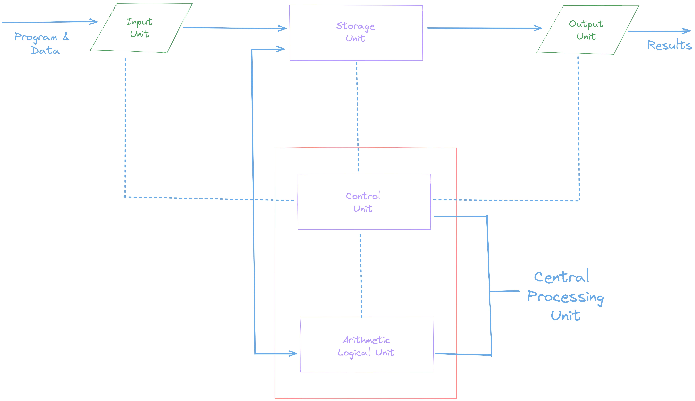
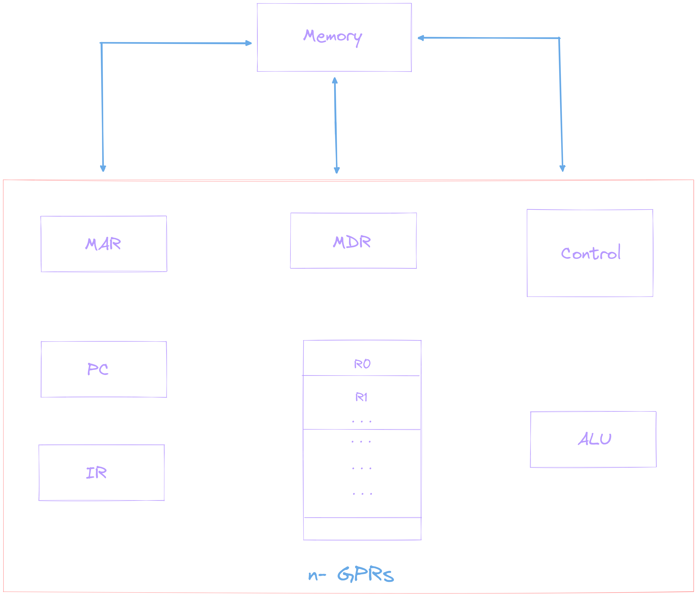

# Computer Organization and Architecture 
## Course syllabus :-
### ***Module- I***
- ### ***Structure of Computers:***
    Computer types, Functional units, Basic operational concepts, Von Neumann Architecture, Bus Structures, Software, Performance.
- ### ***Architecture of Computers:***
    Fixed-point multiplication - Booth's algorithm, Fixed-point division - Restoring and non-restoring algorithms, Floating-point number representation- IEEE 754 format and Floating-point arithmetic operation

---
</br>

## Structure of Computers
</br>

### ***Computer Types***

Before starting the course, we need to understand the different types of computers.
- ***Personal Computer:*** This is the most common type found in homes, schools,Business offices etc., It is the most common type of desk top computers with processing and storage units along with various input and output devices. 

    this has:
    - processing- & storage-units
    - video & audio output-units
    - Keyboard & mouse input-units.
- ***Note book computers:*** These are compact and portable versions of PC(Personal Computer) with limited storage capacity.
- ***Work stations:*** These have high resolution input/output (I/O) graphics capability, but with same dimensions as that of desktop computer. These are used in engineering applications of interactive design work. In simple, words these have more computational-power than PC.
- ***Enterprise Systems (Mainframes):*** These are used for business data processing in medium to large corporations that require much more computing power and storage capacity than work stations. Internet associated with servers have become a dominant
worldwide source of all types of information.

    These are referred to as
    - server at low-end and
    - Super-computers at high end.
- ***Super computers:***  These are the most advanced and powerful computers in the world. They are used for data processing in large scale organizations.

### ***Functional Units***

A computer A computer consists of five functionally independent main parts 
1. input
2. memory
3. arithmetic logic unit (ALU)
4. output
5. control unit. 



Input device accepts the coded information as source program i.e. high level language. This is either stored in the memory or immediately used by the processor to perform the desired operations. The program stored in the memory determines the processing steps. Basically the computer converts one source program to an object program. i.e. into machine language.

Finally the results are sent to the outside world through output device. All of these actions are coordinated by the control unit. 

- ***Input unit:*** The source program/high level language program/coded information/simply data
is fed to a computer through input devices keyboard is a most common type. Whenever a key is pressed, one corresponding word or number is translated into its equivalent binary code over a cable & fed either to memory or processor. 

- ***Memory unit:*** This unit is used to store program and data. There are basically two types of memory units:
    1. ***Primary memory:*** This memory is  exclusively associated with the processor and operates at the electronic-speed, programs must be stored in this memory while they are being executed.
    2. ***Secondary memory:*** This is used where large amounts of data & programs have to be stored, particularly information that is accessed infrequently.
    
    </br>

    >  The memory contains a large number of semiconductors storage cells. Each capable of storing one bit of information. These are processed in a group of fixed site called ***word***. To provide easy access to a word in memory, a distinct address is associated with each word location

- ***Arithmetic logic unit (ALU):*** Most of the computer operators are executed in ALU of the processor like
addition, subtraction, division, multiplication, etc. the operands are brought into the ALU from memory and stored in high speed storage elements called register. Then according to the instructions the operation is performed in the required sequence.

- ***Output unit:*** The results of the computation are sent to the outside world through output devices. These are usually keyboard, video, audio, etc.

- ***Control unit:*** This unit is responsible for the coordination of the other units. It is responsible for the sequencing of the operations and the control of the flow of the program.


### ***Basic Operational Concepts***

To perform a given task an appropriate program consisting of a list of instructions is stored in the memory. Individual instructions are brought from the memory into the processor, which executes the specified operations. Data to be stored are also stored in the memory.

Example:- `Add LOCA, R0`

This instruction adds the operand at memory location `LOCA`, to operand in register `R0` & places the sum into register. This instruction requires the performance of several steps,
1. First the instruction is fetched from the memory into the processor. 
2. The operand at `LOCA` is fetched and added to the contents of `R0`
3. Finally the resulting sum is stored in the register `R0` 

The preceding add instruction combines a memory access operation with an ALU
Operations. In some other type of computers, these two types of operations are performed
by separate instructions for performance reasons

```
Load LOCA, R1
Add R1, R0 
```
Transfers between the memory and the processor are started by sending the
address of the memory location to be accessed to the memory unit and issuing the
appropriate control signals. The data are then transferred to or from the memory. 



The fig shows how memory & the processor can be connected. In addition to the
ALU & the control circuitry, the processor contains a number of registers used for several different purposes. 

- ***The instruction register (IR):*** This register contains the _instruction_ currently being executed.Its output is available for the control circuits which generates the timing signals that control the various processing elements in one execution of instruction. 
- ***The program counter (PC):*** This register contains the _memory address_ of the next instruction to be fetched and executed.

Besides IR and PC, there are n-general purpose registers `R0` through `Rn-1`.

The other two registers which facilitate communication with memory are: - 
1. ***The Memory Address Register (MAR):*** - It holds the address of the location to be accessed.
2. ***The Memory Data Register (MDR):*** - It holds the data to be transferred to or from the memory.

</br>

***Operating steps are***

1. Programs reside in the memory & usually get these through the I/P unit.
2. Execution of the program starts when the PC is set to point at the first instruction
of the program. 
3. Contents of PC are transferred to MAR and a Read Control Signal is sent to the
memory. 
4. After the time required to access the memory elapses, the address word is read out of the memory and loaded into the MDR.
5. Now contents of MDR are transferred to the IR & now the instruction is ready to
be decoded and executed.
6. If the instruction involves an operation by the ALU, it is necessary to obtain the
required operands. 
7. An operand in the memory is fetched by sending its address to MAR & Initiating
a read cycle. 
8. When the operand has been read from the memory to the MDR, it is transferred
from MDR to the ALU. 
9. After one or two such repeated cycles, the ALU can perform the desired
operation. 
10. If the result of this operation is to be stored in the memory, the result is sent to
MDR. 
11. Address of location where the result is stored is sent to MAR & a write cycle is
initiated. 
12. The contents of PC are incremented so that PC points to the next instruction that
is to be executed. 

Normal execution of a program may be preempted (temporarily interrupted) if
some devices require urgent servicing, to do this one device raises an Interrupt signal. 

An interrupt is a request signal from an I/O device for service by the processor.
The processor provides the requested service by executing an appropriate interrupt
service routine.

The Diversion may change the internal stage of the processor its state must be
saved in the memory location before interruption. When the interrupt-routine service is
completed the state of the processor is restored so that the interrupted program may
continue
