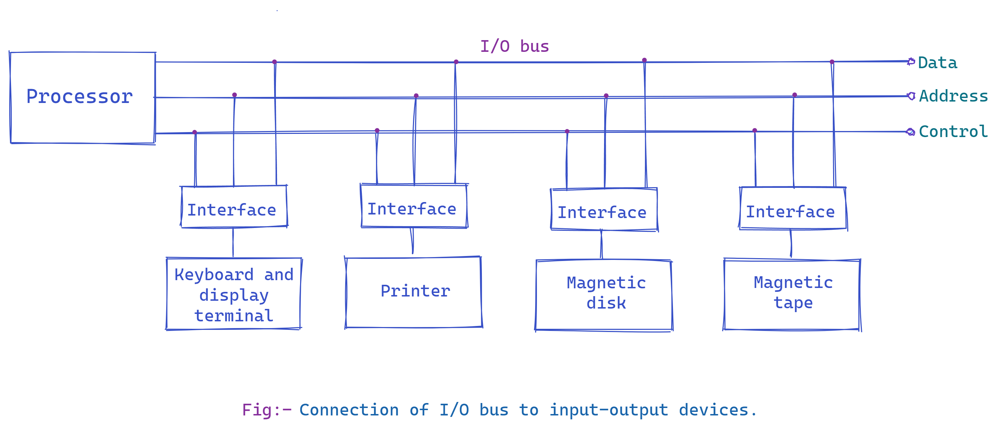
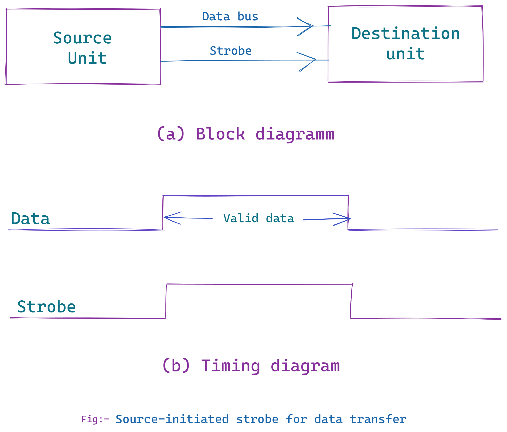
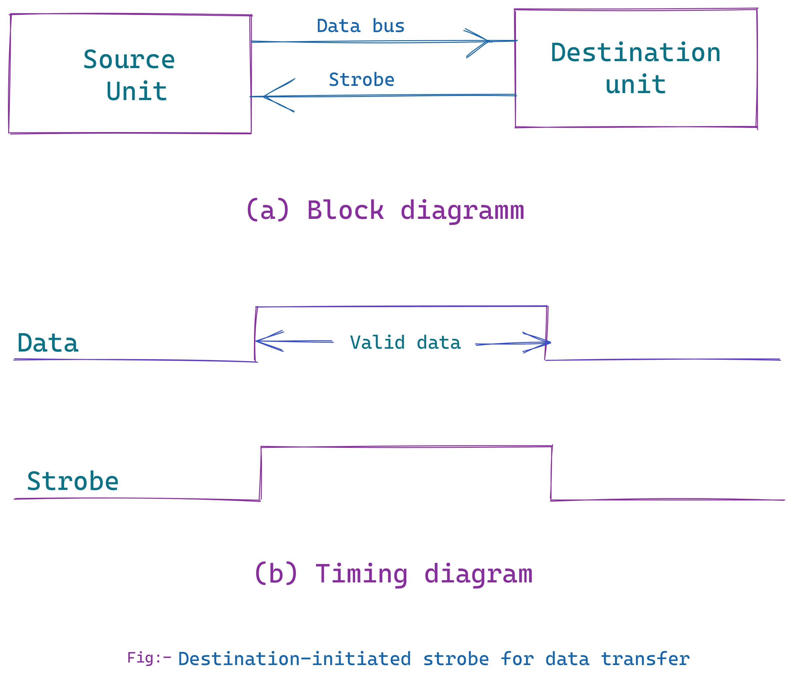

# Input-Output Organization
## Peripheral Devices
The input-output subsystem of a computer, referred to as I/O , provides an
effldent mode of communication between the central system and the outside
environment. 

Programs and data must be entered into computer memory for
processing and results obtained from computations must be recorded or dis­played for the user. 

A computer serves no useful purpose without the ability to receive information from an outside souroe and to transltUt results in a
meaningful form.

The most familiar means of entering information into a computer is
through a **typewrite** like **keyboard** that allows a person to enter alphanumeric information directly.

Every time a key is depressed, the terminal sends a binary
coded character to the computer.The fastest possible speed for entering
information this way depends on the person's typing speed.

On the other hand, the central processing unit is an extremely fast device capable of performing operations at very high speed. When input information is transferred to the processor via a slow keyboard, the processor will be idle most of the time while waiting for the information to arrive.

To use a computer efficiently, a large amount of programs and data must be prepared in advance and transmitted into a storage medium such as magnetic tapes or disks .

The information in the disk is then transferred into computer memory at a rapid rate.

Results of programs are also transferred into a high-speed storage, such as disks, from which they can be transferred later into a printer to provide a printed output of results.

----
Devices that are under the direct control of the computer are said to be
connected on-line.

These devices are designed to read information into or out of the memory unit upon command from the CPU and are considered to be part of the total computer system.

*Input or output devices attached to the computer are also called **peripherals** .*

Among the most common **peripherals** are **keyboards**, **display units**, and **printers**.

**Peripherals** that provide auxiliary storage for the system are **magnetic disks and tapes**. Peripherals are electromechanical and electromagnetic devices of some complexity.

---
### **MAGNETIC TAPES.**
Magnetic tapes are used mostly for storing files of data: *for example*, a
company's payroll record. Access is sequential and consists of records that can be accessed one after another as the tape moves along a stationary read-write mechanism. It is one of the cheapest and slowest methods for storage and has the advantage that tapes can be removed when not in use.

### **MAGNETIC DISK.**
Magnetic disks have high-speed rotational surfaces coated with magnetic material. Access is achieved by moving a read-write mechanism to a track in the magnetized surface. Disks are used mostly for bulk storage of programs and data.

---
Other input and output devices encountered in computer systems are
digital incremental plotters, optical and magnetic character readers, analog-todigital converters, and various data acquisition equipment.

Not all input comes from people, and not all output is intended for people. Computers are used to control various processes in real time, such as machine tooling, assembly line procedures, and chemical and industrial processes. For such applications, a method must be provided for sensing status conditions in the process and sending control signals to the process being controlled.

****

# Input-Output Interface
Input-output interface provides a method for transferring information between internal storage and external I/0 devices. Peripherals connected to a computer need special communication links for interfacing them with the
central processing unit. The purpose of the communication link is to resolve
the differences that exist between the central computer and each peripheral.
The major differences are:
1. Peripherals are electromechanical and electromagnetic devices and their manner of operation is different from the operation of the CPU and
memory, which are electronic devices. Therefore, a conversion of signal
values may be required.

2. The data transfer rate of peripherals is usually slower than the transfer
rate of the CPU, and consequently, a synchronization mechariism may
be needed.

3. Data codes and formats in peripherals differ from the word format in
the CPU and memory.

4. The operating modes of peripherals are different from each other and
each must be controlled so as not to disturb the operation of other
peripherals connected to the CPU.

To resolve these differences, computer systems include special hardware
components between the CPU and peripherals to supervise and synchronize
all input and output transfers. These components are called **interface units** because they interface between the *processor bus and the peripheral device.* 

In addition, each device may have its own controller that supervises the operations of the particular mechanism in the peripheral.

## I/O Bus and Interface Modules
A typical communication link between the processor and several peripherals
is shown in this ***fig:- Module_5(1)***

The I/O bus consists of data lines, address lines, and
control lines.

The magnetic disk, printer, and terminal are employed in practically any general-purpose computer.The magnetic tape is used in some computers for backup storage.

Each peripheral device has associated with it an interface unit. Each interface decodes the address and control received from the I/O bus, interprets them for the peripheral, and provides signals for the periphe.ral controller.

It also synchronizes the data flow and supervises the transfer between peripheral and processor. Each peripheral has its own controller that operates the particular electromechanical device.

For example, the printer controUer controls the paper motion, the print timing, and the selection of printing characters. A controUer may be housed separately or may be physically integrated with the peripheral.

The I/O bus from the processor is attached to all peripheral interfaces. To communicate with a particular device, the processor places a device address on the address lines. Each interface attached to the I/O bus contains an address decoder that monitors the address lines. When the interface detects its own address, it activates the path between the bus lines and the device that it
controls. All peripherals whose address does not correspond to the address in the bus are disabled by their interface.
### **I/O command**
At the same time that the address is made avallable In the address lines, the processor provides a function code in the control lines. The *interface* selected responds to the function code and proceeds to execute it. The function code is referred to as an ***I/O command*** and is in essence an instruction that is executed in the interface and its attached peripheral unit. The interpretation of the command depends on the peripheral that the processor is addressing. There are four types of commands that an interface may receive. They are classified as control, status, data output, and data input.
### **Control command**
A ***control command*** is issued to activate the peripheral and to inform it what
to do. For example, a magnetic tape unit may be instructed to backspace the
tape by one record, to rewind the tape, or to start the tape moving in the
forward direction. The particular control command issued depends on the
peripheral, and each peripheral receives its own distinguished sequence of
control commands, depending on its mode of operation.
### **Status command**
A ***status command*** is used to test various status conditions in the interface
and the peripheral. For example, the computer may wish to check the status
of the peripheral before a transfer is initiated. During the transfer, one or more
errors may occur which are detected by the interface. These errors are designated
by setting bits in a status register that the processor can read at certain
intervals.
### **Output data**
A ***data output command*** causes the interface to respond by transferring data
from the bus into one of its registers. Consider an example with a tape unit.
The computer starts the tape moving by issuing a control command. The processor then monitors the status of the tape by means of a status command. When the tape is in the correct position, the processor issues a data output command. The interface responds to the address and command and transfers the information from the data lines in the bus to its buffer register. The interface then communicates with the tape controller and sends the data to be stored on tape.
### **Input data**
The ***data input command*** is the opposite of the data output. In this case the
interface receives an item of data from the peripheral and places it in its buffer
register. The processor checks if data are available by means of a status command
and then issues a data input command. The interface places the data on
the data lines, where they are accepted by the processor.

---
# Modes of Transfer
Binary information received from an external device is usually stored in memory for later processing. Information transferred from the central computer into an external device originates in the memory unit. The CPU merely executes the 110 instructions and may accept the data temporarily, but the ultimate source or destination is the memory unit. Data transfer between the central computer and 110 devices may be handled in a variety of modes. Some modes use the CPU as an intermediate path; others transfer the data directly to and from the memory unit. Data transfer to and from peripherals may be handled in one of three possible modes:

1. Programmed I/O
2. Interrupt-initiated I/O
3. Direct memory access (DMA)

## Programmed I/O
Programmed I/O operations are the result of 110 instructions written in
the computer program. 

Each data item transfer is initiated by an instruction
in the program. Usually, the transfer is to and from a CPU register and
peripheral. 

Other instructions are needed to transfer the data to and from CPU
and memory. 

Transferring data under program control requires constant monitoring
of the peripheral by the CPU. Once a data transfer is initiated, the CPU
is required to monitor the interface to see when a transfer can again be made.

It is up to the programmed instructions executed in the CPU to keep close tabs on everything that is taking place in the interface unit and the I/O device.

In the programmed I/O method, the CPU stays in a program loop until
the 110 unit indicates that it is ready for data transfer. This is a time-consuming process since it keeps the processor busy needlessly.

This is a time-consuming process since it keeps the processor busy needlessly. It can be avoided by using an ***interrupt facility*** and special commands to inform the interface to issue an
***interrupt request*** signal when the data are available from the device. 

In the meantime the CPU can proceed to execute another program. 

The interface meanwhile keeps monitoring the device. When the interface determines that the device is ready for data transfer, it generates an ***interrupt request*** to the computer. 

Upon detecting the external ***interrupt signal***, the CPU momentarily
stops the task it is processing, branches to a service program to process the I/O transfer, and then returns to the task it was originally performing.

## DMA
Transfer of data under programmed I/O is between CPU and peripheral.

In ***direct memory access (DMA)***, the interface transfers data into and out of the memory unit through the memory bus. 

The CPU initiates the transfer by supplying the interface with the starting address and the number of words needed to be transferred and then proceeds to execute other tasks. 

When the transfer is made, the **DMA** requests memory cycles through the memory bus.

When the request is granted by the memory controller, the **DMA** transfers the data directly into memory. 

The CPU merely delays its memory access operation to allow the direct memory I/O transfer. 

Since peripheral speed is usually slower than processor speed, I/O-memory transfers are infrequent compared to processor access to memory.

## IOP
Many computers combine the interface logic with the requirements for
direct memory access into one unit and call it an ***I/O processor (IOP).*** 

The **IOP** can handle many peripherals through a **DMA** and **interrupt facility.**

In such a system, the computer is divided into three separate modules: the 
* Memory unit, 
* The CPU, and 
* The lOP.

---
## Asynchronous Data Transfer

Asynchronous data transfer between two independent units requires that control signals be transmitted between the communicating units to indicate the time at which data is being transmitted.

### **Strobe**
One way of achieving this is by means of a strobe pulse supplied by one of the units to indicate to the other unit when the transfer has to occur.
### **Handshaking**
Another method commonly used is to accompany each data item being transferred with a control signal that indicates the presence of data in the bus. The unit receiving the data item responds with another control signal to acknowledge receipt of the data. This type of agreement between two independent units is referred to as lumdshaking .

The **strobe pulse** method and the **handshaking** method of asynchronous data transfer are not restricted to VO transfers. In fact, they are used extensively on numerous occasions requiring the transfer of data between two independent units.

In the general case we consider the transmitting unit as the source
and the receiving unit as the destination. *For example*, the CPU is the source unit during an output or a write transfer and it is the destination unit during an input or a read transfer.

It is customary to specify the asynchronous transfer between two independent units by means of a timing diagram that shows the timing relationship that must exist between the control signals and the data in the buses.

The sequence of control during an asynchronous transfer depends on whether the transfer is initiated by the source or by the destination unit.

## Strobe Control
The strobe control method of asynchronous data transfer employs a single
control line to time each transfer. The strobe may be activated by either the source or the destination unit.

This ***fig:- Module_5(2)*** shows a source-initiated transfer.

The data bus carries the binary information from source unit to the destination unit. Typically, the bus has multiple lines to transfer an entire byte or word. The strobe is a single line that informs the destination unit when a valid data word is available in the bus.

This ***fig:- Module_5(3)*** shows a data transfer initiated by the destination unit.

In this case the destination unit activates the strobe pulse, informing the source to provide the data. The source unit responds by placing the requested binary information on the data bus. The data must be valid and remain in the bus long enough for the destination unit to accept it.

The falling edge of the strobe pulse can be used again to trigger a destination register.

The destination unit, then disables the strobe. The source removes the data from the bus after a predetermined time interval.

In many computers the strobe pulse is actually controlled by the clock pulses in the CPU.

The CPU is always in control of the buses and informs the external units how to transfer data. *For example*, the strobe of ***fig:- Module_5(2)*** could be a memory-write control signal from the CPU to a memory unit.

The source, being the CPU, places a word on the data bus and informs the memory unit, which is the destination, that this is a write operation.

Similarly, the strobe of ***fig:- Module_5(3)*** could be a memory-read control signal from the CPU to a memory unit.

The destination, the CPU, initiates the read operation to inform the memory, which is the source, to place a selected word into the data bus.

The transfer of data between the CPU and an interface unit is similar to
the strobe transfer just described. Data transfer between an interface and an I/O device is commonly controlled by a set of handshaking lines.

